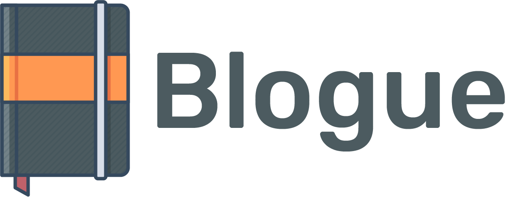

    
     
     
    <i>
        Application for share your favorites movies, books and music ✨
    </i>

    

 

# 👋 About the project

The propuse of this project is resolve the next concepts:

- Concepts Philosophers.
    - Code review
    - SOLID
- Concepts theorics.
    - OOP
    - Design Patterns
    - Architecture Patters

In general, the next list will cover this project:
- ¿Qué es y par qué utilizar el _"code review"_?
- ¿Qué patrones de arquitectura conoces y cómo funcionan?
- ¿Cuáles son los niveles de acceso y cómo funcionan?
- ¿Qué patrones de diseño conoces y cómo funcionan?
- ¿Qué es SOLID?
- ¿Qué es una clase?
- ¿Qué es y para qué se utiliza la herencia?
- ¿Qué es y para qué se utiliza las interfaces?
- ¿Qué es polimorfismo?
- ¿Qué es y cómo funciona una API web?
- ¿Qué herramientas se pueden utilizar para probar Web APIs?
- ¿Qué herramientas has utilizado para el manejos de errores?
- TDD

Depend of each concept, you can visualize all implementations or codes along of directories.

### 👤 Author
@roremDev - Emmanuel Rodríguez Ramírez

_Software Engineer_